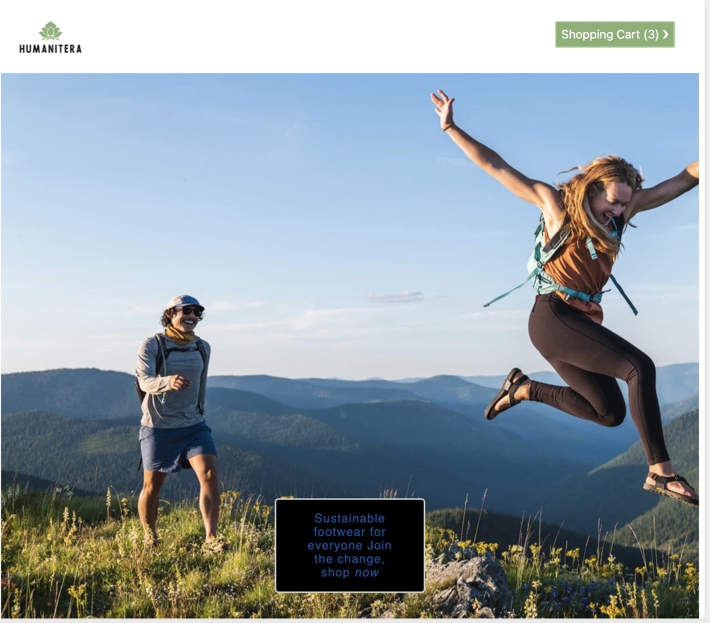
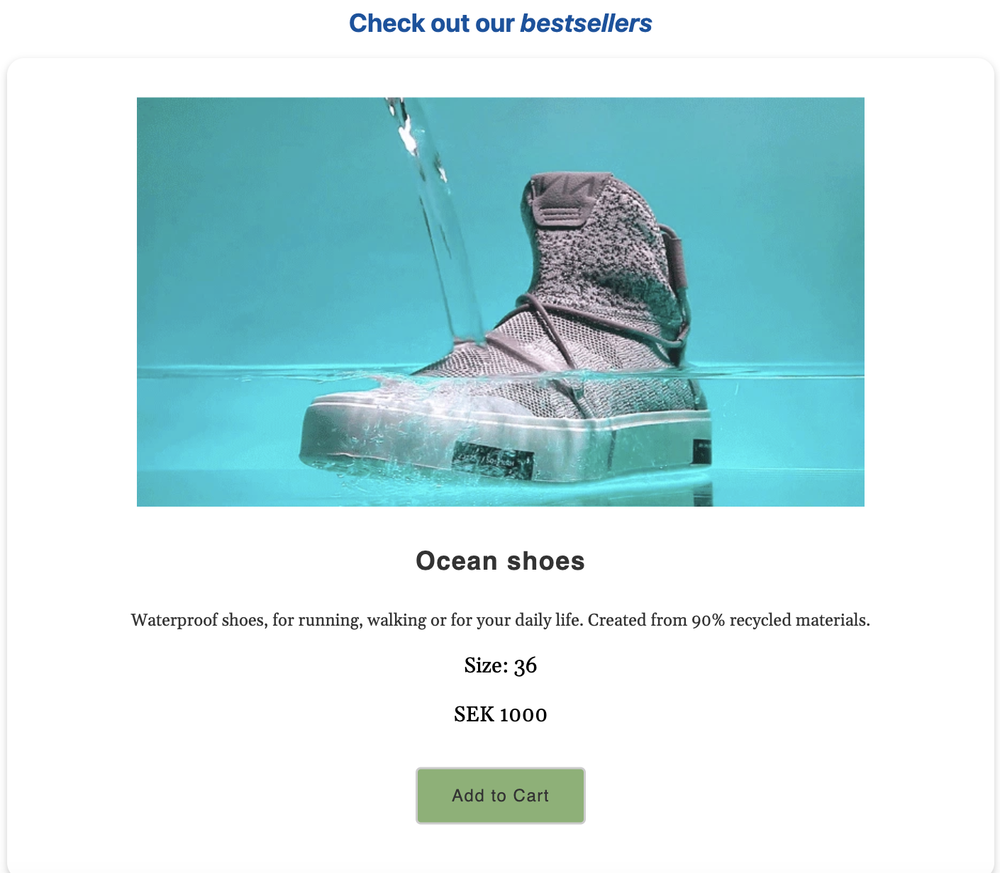
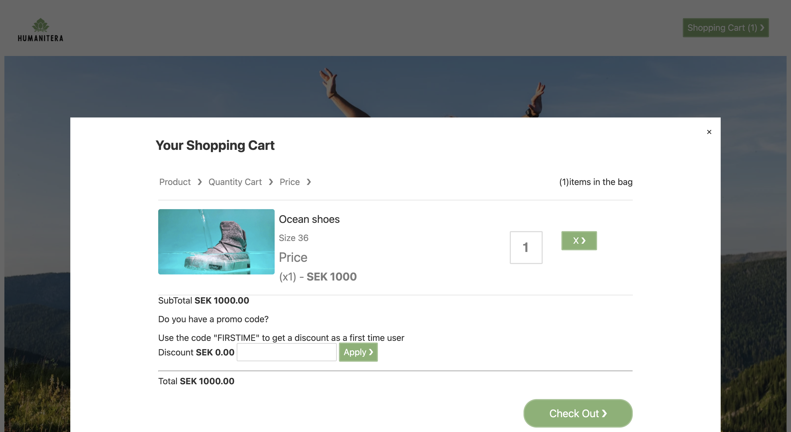
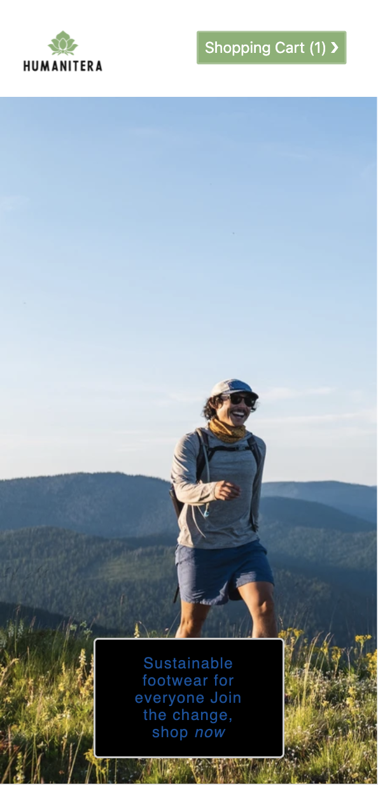
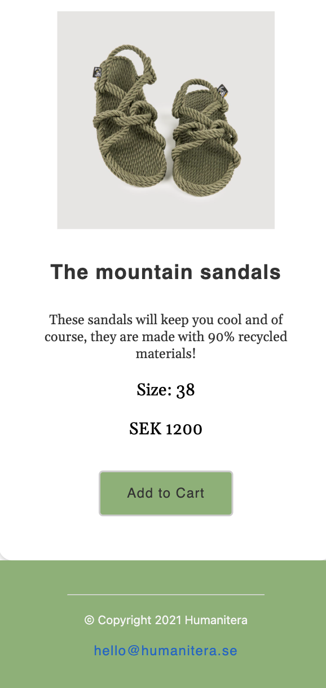
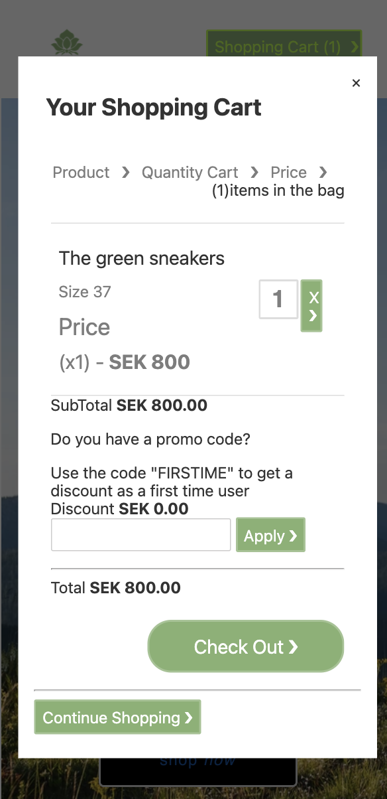

## Humanitera 


Humanitera is a small e-commerce made with svelte, HTML & CSS where you can buy sustainable shoes.

## Project Information

Humanitera is a different concept shop where users can buy sustainable footwear made from recycled materials.
The website is responsive and has a shopping cart modal where users can insert discount codes and get a discount for their first order. 

## Preview


## Home Page- computer version


## Products - computer version


## Shopping Cart - computer version


## Home Page - mobile version


##  Products  - mobile version


## Shopping Cart - mobile version


## Installation and Setup Instructions

Install the dependencies...

```bash
cd svelte-app
npm install
```

...then start [Rollup](https://rollupjs.org):

```bash
npm run dev
```

Navigate to [localhost:5000](http://localhost:5000). You should see your app running. Edit a component file in `src`, save it, and reload the page to see your changes.

By default, the server will only respond to requests from localhost. To allow connections from other computers, edit the `sirv` commands in package.json to include the option `--host 0.0.0.0`.

If you're using [Visual Studio Code](https://code.visualstudio.com/) we recommend installing the official extension [Svelte for VS Code](https://marketplace.visualstudio.com/items?itemName=svelte.svelte-vscode). If you are using other editors you may need to install a plugin in order to get syntax highlighting and intellisense.


### Build with

    - Svelte 
    - HTML
    - CSS


### Improvements

The project will be further improved by adding more functionalities to the modal and adding testing with jest.

## About me

I am a junior programmer who love to learn new things.

[ LinkedIn](https://www.linkedin.com/in/marta-louridob/?locale=en_US/)
&nbsp;

[ GitHub](https://github.com/MartaLourido)